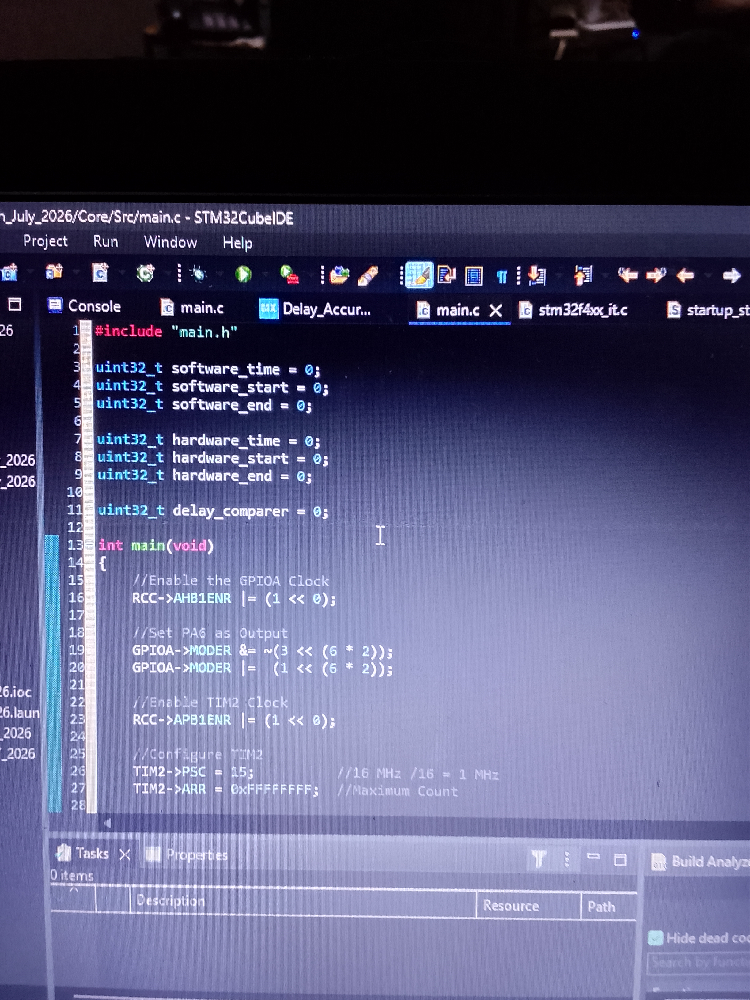

# Delay Accuracy Simulator Using STM32F401CCU6

## Overview

This project compares the execution time of a software delay loop with a hardware timer delay using TIM2. The difference between both delays is measured to evaluate the accuracy of software-based delays.

## Project code
[Click here to check out the project code](code)

## Project Images

## What I Learned

* Configuring TIM2 as a free-running timer.
* Measuring execution time using the timer counter (CNT).
* Comparing software and hardware delays.
* Evaluating delay accuracy using timer counts.
* Using GPIO output to indicate the comparison result.

## Project Demonstration video

[Click here to check out the demo video](https://youtube.com/shorts/XLIwz9vNr3M)

## Components Used

* STM32F401CCU6 Black Pill
* LED
* 220 Ω Resistor

## Outcome

Successfully measured and compared software and hardware delay durations, using an LED to indicate whether the measured delay difference exceeded the defined threshold.
